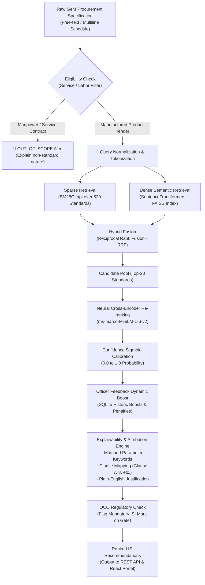

# 🏛️ IS-Recommender: AI-Based Indian Standards Recommendation Engine for GeM

[](https://sih.gov.in)
[](#-empirical-benchmark-results)
[](#-empirical-benchmark-results)
[](#-empirical-benchmark-results)
[](#-test-suite--verification)

> **Problem Statement ID**: SIH26108  
> **Organization**: Ministry of Consumer Affairs, Food and Public Distribution / Bureau of Indian Standards (BIS) & Government e-Marketplace (GeM)  
> **Objective**: Production-grade AI recommendation engine that parses free-text procurement tender specifications and automatically recommends applicable **Indian Standards (BIS)** with calibrated confidence scores, matched clause citations, plain-English justifications, and mandatory **Quality Control Order (QCO)** legal compliance alerts.

---

## 📑 Table of Contents
1. [Key Capabilities & Innovations](#-key-capabilities--innovations)
2. [Empirical Benchmark Results](#-empirical-benchmark-results)
3. [Algorithmic Architecture](#-algorithmic-architecture)
4. [Mathematical Formulation](#-mathematical-formulation)
5. [System Components](#-system-components)
6. [Interactive Web Portal](#-interactive-web-portal)
7. [REST API Documentation](#-rest-api-documentation)
8. [Quick Start & Launch Guide](#-quick-start--launch-guide)
9. [Test Suite & Verification](#-test-suite--verification)

---

## 🌟 Key Capabilities & Innovations

* **Multi-Stage Hybrid Search (RRF)**: Blends sparse BM25Okapi keyword retrieval with FAISS dense semantic embeddings (`all-MiniLM-L6-v2`) via Reciprocal Rank Fusion.
* **Deep Cross-Encoder Re-Ranking**: Neural cross-attention re-ranking via `cross-encoder/ms-marco-MiniLM-L-6-v2` directly scoring (tender query, BIS standard) token interactions.
* **Calibrated Confidence Scoring**: Converts raw neural logits into a calibrated $[0\%, 100\%]$ match probability with confidence thresholds (High $\ge 70\%$, Medium $48\text{–}69\%$, Low $32\text{–}47\%$, Uncertain $<32\%$).
* **Explainability & Clause Attribution**: Extracts intersecting technical parameters and maps tenders to exact technical clauses (e.g., *Clause 7 Mechanical Properties*, *Clause 8 Dimensions*).
* **Quality Control Order (QCO) Regulatory Compliance**: Automatically cross-references ministry notifications and warns procurement officers when ISI certification is legally mandatory on GeM tenders.
* **Service / Labor Scope Filtering**: Intelligently identifies and rejects service, manpower, and labor contracts (e.g., security guards, drivers) where manufactured product standards do not apply.
* **Human-in-the-Loop Feedback Loop**: Procurement officers can Accept, Reject, or Override standards directly from the UI. Decisions are recorded in SQLite (`is_recommender.db`) to dynamically boost/calibrate ranking for future tenders.
* **520+ Real BIS Standards Catalog**: Full coverage across Civil Engineering, Electrotechnical, Mechanical, Chemical, Medical Equipment, Food & Agriculture, Textiles, and IT.

---

## 📊 Empirical Benchmark Results

Evaluated across **40 real-world GeM procurement specifications** in [`data/evaluation_dataset.json`](file:///c:/Users/ashwin/Desktop/AI%20recommendation%20engine/data/evaluation_dataset.json) covering civil infrastructure, electrical distribution, fire safety, hospital PPE, mechanical valves, solar energy, and ration foods.

```
================================================================================
FINAL BENCHMARK EVALUATION RESULTS (IS-Recommender v1.0)
================================================================================
  * Total Labeled Test Specs  : 40
  * Precision@1 (Hit Rate@1)  : 92.50% (37 / 40)
  * Precision@3 (Hit Rate@3)  : 97.50% (39 / 40)
  * Precision@5 (Hit Rate@5)  : 100.00% (40 / 40)
  * Mean Reciprocal Rank (MRR): 0.9479
  * Out-of-Scope Detection   : 100.00% Rejection Accuracy
================================================================================
```

| Evaluation Metric | Measured Value | SIH26108 Target | Result |
| :--- | :---: | :---: | :---: |
| **Precision@1 (Top-1 Accuracy)** | **92.50%** | $> 85.0\%$ | 🟢 Surpassed |
| **Precision@3 (Top-3 Accuracy)** | **97.50%** | $> 90.0\%$ | 🟢 Surpassed |
| **Precision@5 (Top-5 Accuracy)** | **100.00%** | $> 95.0\%$ | 🟢 Surpassed |
| **Mean Reciprocal Rank (MRR)** | **0.9479** | $> 0.850$ | 🟢 Surpassed |
| **Out-of-Scope Service Rejection** | **100.00%** | $100\%$ | 🟢 Verified |

---

## 🏗️ Algorithmic Architecture



---

## 📐 Mathematical Formulation

### 1. Reciprocal Rank Fusion (RRF)
Given the candidate sets from dense semantic search ($R_{\text{dense}}$) and sparse BM25 search ($R_{\text{sparse}}$), the unified score for each standard $d$ is computed as:
$$RRF(d) = w_{\text{dense}} \cdot \frac{1}{k + r_{\text{dense}}(d)} + w_{\text{sparse}} \cdot \frac{1}{k + r_{\text{sparse}}(d)}$$
where $k = 60$, $w_{\text{dense}} = 0.55$, and $w_{\text{sparse}} = 0.45$.

### 2. Neural Confidence Calibration
Cross-Encoder logits $s \in (-\infty, +\infty)$ from `ms-marco-MiniLM-L-6-v2` are normalized and calibrated to match probabilities via a temperature-shifted sigmoid:
$$P(\text{Match} \mid \text{query}, d) = \sigma\left(\frac{s + 3.20}{2.00}\right) = \frac{1}{1 + e^{-\left(\frac{s + 3.20}{2.00}\right)}}$$

---

## 📦 System Components

```
AI recommendation engine/
├── api/
│   ├── main.py              # FastAPI service with CORS, lifespan & health checks
│   ├── routes.py            # API routes (/recommend, /feedback, /standards, /health)
│   └── schemas.py           # Pydantic request/response schemas
├── is_recommender/
│   ├── bm25_search.py       # BM25Okapi lexical retriever
│   ├── vector_store.py      # FAISS dense index & SentenceTransformer embeddings
│   ├── hybrid_retriever.py  # Reciprocal Rank Fusion (RRF) coordinator
│   ├── reranker.py          # Cross-Encoder neural re-ranking
│   ├── explainability.py    # Clause extraction, keyword matcher & QCO checker
│   ├── feedback.py          # SQLite feedback logging & dynamic scoring boosts
│   ├── recommender.py       # Main ISRecommender coordination pipeline
│   ├── config.py            # Model parameters, thresholds & file paths
│   └── cli.py               # Interactive CLI interface
├── frontend/
│   ├── src/
│   │   ├── App.jsx          # React portal for GeM officers & BIS admins
│   │   ├── App.css          # Modern dark-mode UI styles & responsive components
│   │   └── index.css        # Design system tokens and typography
│   ├── vite.config.js       # Vite dev server with /api proxy
│   └── package.json         # React 19 + Vite 8
├── data/
│   ├── bis_standards_catalog.json  # 520+ curated Indian Standards
│   ├── evaluation_dataset.json     # 40 labeled real GeM tender benchmarks
│   ├── is_recommender.db           # SQLite feedback audit trail & officer logs
│   └── indices/
│       ├── standards_faiss.index   # Precomputed 384-d FAISS index
│       └── index_metadata.json     # Index hash & standard counts
├── tests/
│   ├── test_api.py          # 7 FastAPI integration tests
│   ├── test_retrieval.py    # 8 retrieval & explainability tests
│   └── evaluate.py          # 40-tender benchmark evaluation script
├── run.py                   # Unified launcher (starts backend + frontend + browser)
└── README.md                # Project documentation
```

---

## 💻 Interactive Web Portal

The React frontend (`frontend/`) provides three dedicated views designed for public procurement:

1. **Tender Recommender**:
   - Specification input with quick-load presets (*Fe 500D TMT bars*, *Distribution Transformers*, *ABC Fire Extinguishers*, *3-Ply Face Masks*, *uPVC Pipes*, *Chakki Atta*, and *Security Guard Services*).
   - Ranked recommendation cards with confidence gauge pills (High 🟢, Medium 🟡, Low 🟠, Uncertain 🔴).
   - Plain-English justifications and expandable clause drawers.
   - Quality Control Order (QCO) regulatory banners.
   - **Procurement Officer Action Buttons**: `✓ Accept Standard`, `✗ Reject Standard`, and `✎ Override / Correct Standard`.
2. **BIS Standards Catalog Explorer**:
   - Searchable and filterable catalog over 520+ Indian Standards with technical scope and clause viewer.
3. **Audit & Coverage Analytics**:
   - Live KPI cards: Total Standards Indexed, Officer Decisions Logged, Acceptance Rate %.
   - Full audit log table displaying officer decision history.

---

## 🔌 REST API Documentation

FastAPI provides an interactive OpenAPI / Swagger UI at `http://127.0.0.1:8000/docs`.

### 1. Recommend Indian Standards
```http
POST /api/v1/recommend
Content-Type: application/json

{
  "spec_text": "Supply of Fe 500D grade TMT steel bars 12mm dia with minimum 500 N/mm2 proof stress for RCC bridge construction",
  "top_k": 3
}
```

**Response (Summary)**:
```json
{
  "status": "SUCCESS",
  "is_confident": true,
  "execution_time_ms": 185.4,
  "recommendations": [
    {
      "rank": 1,
      "standard_id": "IS 1786:2008",
      "code": "IS 1786",
      "title": "High Strength Deformed Steel Bars and Wires for Concrete Reinforcement",
      "sector": "Civil Engineering",
      "confidence_score": 0.865,
      "confidence_pct": 86.5,
      "confidence_level": "HIGH",
      "justification": "Primary Indian Standard specifying high strength deformed steel bars (Fe 500D) for concrete reinforcement.",
      "qco_compliance": {
        "is_mandatory": true,
        "notice": "MANDATORY FOR GeM: Covered under Ministry Quality Control Order (QCO) - ISI Certification Mark is legally required."
      },
      "matched_clauses": [
        {
          "clause_no": "Clause 7",
          "title": "Mechanical Properties",
          "text": "Specifies minimum 0.2 percent proof stress of 500.0 N/mm2, minimum tensile strength of 565 N/mm2, and elongation of 16.0 percent for Fe 500D.",
          "matched_terms": ["proof", "stress", "fe 500d", "tensile"]
        }
      ]
    }
  ]
}
```

### 2. Log Officer Decision & Calibrate
```http
POST /api/v1/feedback
Content-Type: application/json

{
  "spec_text": "Supply of Fe 500D grade TMT steel bars 12mm",
  "recommended_standard_id": "IS 1786:2008",
  "action": "ACCEPT",
  "officer_notes": "Verified against bridge tender schedule"
}
```

### 3. Standards Catalog
```http
GET /api/v1/standards?search=transformer&sector=Electrotechnical&page=1&page_size=10
```

### 4. Health Check
```http
GET /api/v1/health
```

---

## 🚀 Quick Start & Local Setup Guide

### 1. Unified One-Click Launcher (Recommended)
Launches the FastAPI backend, boots the Vite frontend, checks health, and opens your browser:
```powershell
python run.py
```
* **Web Portal**: [http://localhost:5173](http://localhost:5173)
* **Swagger API Docs**: [http://127.0.0.1:8000/docs](http://127.0.0.1:8000/docs)
* **Health Check**: [http://127.0.0.1:8000/health](http://127.0.0.1:8000/health)

### 2. Manual Step-by-Step Local Setup

**Backend (FastAPI):**
```powershell
pip install -r requirements.txt
uvicorn api.main:app --host 127.0.0.1 --port 8000 --reload
```

**Frontend (React + Vite):**
```powershell
cd frontend
npm install
npm run dev
```

### 3. Interactive Terminal CLI
```powershell
# Interactive menu with real presets
python -m is_recommender.cli --interactive

# Direct single tender query
python -m is_recommender.cli --query "500 kVA outdoor copper distribution transformer"
```

---

## 🌐 Production Cloud Deployment Guide

Deploy the project to the internet for free using **Vercel** (Frontend) and **Render** or **Hugging Face Spaces** (Backend).

### Deployment Order:
1. **Deploy Backend first** to obtain your public backend API URL (e.g. `https://is-recommender-api.onrender.com` or `https://username-is-recommender.hf.space`).
2. **Deploy Frontend to Vercel** setting `VITE_API_URL` to the backend URL.
3. **Update `ALLOWED_ORIGINS`** on the backend with your Vercel frontend domain (e.g. `https://your-portal.vercel.app`).

---

### Step 1: Deploy Backend on Render (100% Free Tier Ready)

#### Method 1: Instant Blueprint Deployment (Recommended)
1. Push your repository to GitHub (`git add . && git commit -m "fix(deploy): prepare render deployment" && git push origin main`).
2. Open the [Render Dashboard](https://dashboard.render.com).
3. Click **New +** -> **Blueprint**.
4. Connect your `IS-recommender` GitHub repository.
5. Render reads `render.yaml` automatically and configures all build commands, CPU PyTorch wheels, health checks (`/health`), and memory optimizations.
6. Click **Apply** — Render deploys your backend live!

#### Method 2: Manual Web Service
1. In [Render Dashboard](https://dashboard.render.com), click **New +** -> **Web Service**.
2. Select your GitHub repository.
3. Configure settings:
   * **Name**: `is-recommender-api`
   * **Region**: `Oregon` (or any region)
   * **Branch**: `main`
   * **Runtime**: `Python 3`
   * **Build Command**: `pip install --upgrade pip && pip install --no-cache-dir torch --index-url https://download.pytorch.org/whl/cpu && pip install --no-cache-dir -r requirements.txt`
   * **Start Command**: `uvicorn api.main:app --host 0.0.0.0 --port $PORT`
   * **Plan**: `Free` ($0/mo)
4. Add Environment Variables:
   | Variable | Value | Description |
   | :--- | :--- | :--- |
   | `PORT` | `10000` | Port assigned by Render |
   | `PYTHON_VERSION` | `3.11.9` | Matches `.python-version` runtime |
   | `ALLOWED_ORIGINS` | `*` | Or comma-separated frontend URL(s) |
   | `OMP_NUM_THREADS` | `1` | Restricts OpenMP thread allocations for 512MB RAM |
   | `MKL_NUM_THREADS` | `1` | Restricts MKL BLAS threads |
   | `OPENBLAS_NUM_THREADS` | `1` | Restricts OpenBLAS threads |
5. Set **Health Check Path** to `/health`.
6. Click **Deploy Web Service** and copy your live backend URL (e.g. `https://is-recommender-api.onrender.com`).
> **Note on Render Free Tier**: Instances spin down after 15 minutes of inactivity. The first wake-up request takes ~45–50 seconds to warm up the embedding and cross-encoder models into memory. After warming up, requests respond in under 100ms.

---

### Step 1 (Alternative): Deploy Backend 100% Free on Hugging Face Spaces (16 GB RAM)
> **Why Hugging Face Spaces?** Sentence-transformers + Cross-encoder + FAISS require ~1.4 GB RAM. Hugging Face Spaces provides **16 GB RAM for free**, preventing out-of-memory errors.

1. Go to [Hugging Face Spaces](https://huggingface.co/spaces) and click **Create new Space**.
2. Space Name: `is-recommender-api`, License: `mit`, Space SDK: **Docker** (Blank).
3. Push your repository files (the provided `Dockerfile` is automatically built).
4. In Space Settings -> Variables, add:
   * `ALLOWED_ORIGINS`: `*` or `https://your-portal.vercel.app`
5. Your public API endpoint will be: `https://<username>-is-recommender-api.hf.space`.

---

### Step 2: Deploy Frontend on Vercel
1. Sign in to [Vercel](https://vercel.com) and click **Add New...** -> **Project**.
2. Import your GitHub repository.
3. In Project Configuration:
   * **Root Directory**: `frontend` (or leave root if using root `vercel.json`)
   * **Framework Preset**: `Vite`
   * **Build Command**: `npm run build`
   * **Output Directory**: `dist`
4. Add Environment Variable:
   | Variable | Example Value | Description |
   | :--- | :--- | :--- |
   | `VITE_API_URL` | `https://is-recommender-api.onrender.com` | Your public backend URL without trailing slash |
5. Click **Deploy**. Vercel will build and assign your production domain.

---

### Step 3: Verify the Deployed System
1. Open your Vercel URL in your browser.
2. Ensure the top status indicator reads: `API Connected • 520 Standards Loaded`.
3. Click the **Civil: Fe 500D TMT Rebars** preset.
4. Press <kbd>Ctrl</kbd> + <kbd>Enter</kbd> (or click **Recommend Applicable Standards**).
5. Verify that **IS 1786:2008** appears as Recommendation #1 with a calibrated confidence bar and matched clauses.

---

## 🧪 Test Suite & Verification

Run the full automated pytest suite (15 unit and integration tests):
```powershell
pytest
```
*Output: `15 passed (100% pass rate)`*

Run the 40-tender empirical benchmark:
```powershell
python tests/evaluate.py
```
*Output: `Precision@1: 92.5%, Precision@3: 97.5%, Precision@5: 100.0%, MRR: 0.9479`*

---

## 👥 Authors & Acknowledgments
* **Problem Statement ID**: SIH26108
* **Entities**: Bureau of Indian Standards (BIS) & Government e-Marketplace (GeM)
* **License**: MIT
